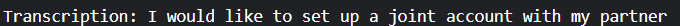
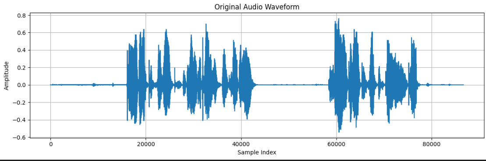
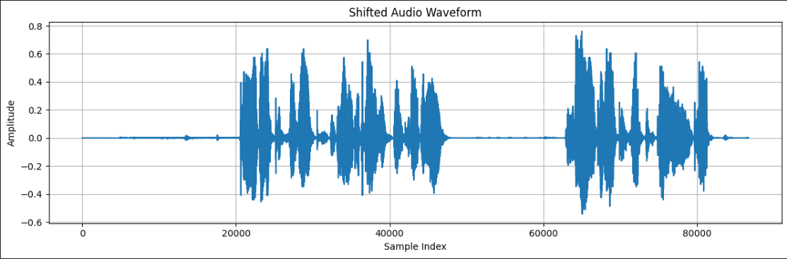
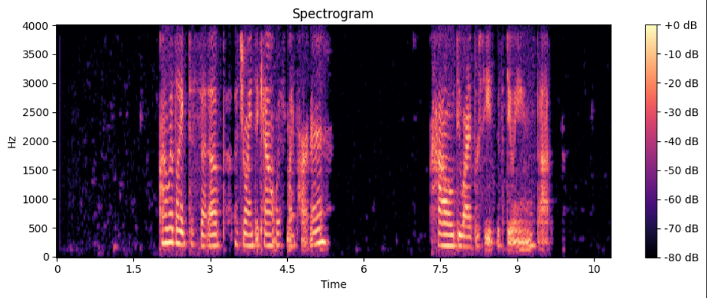
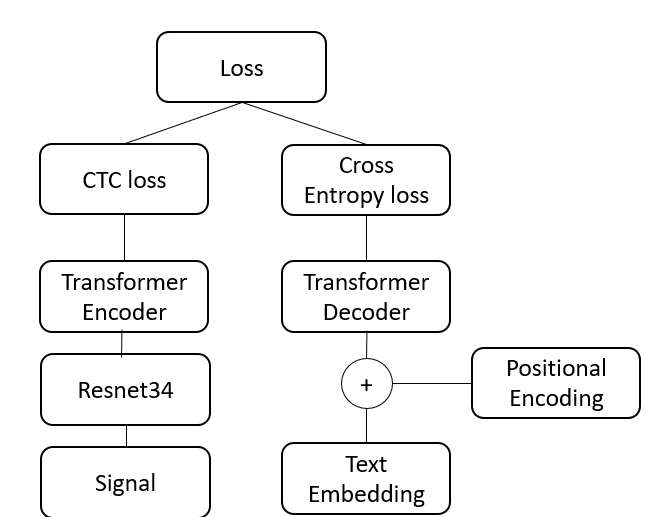
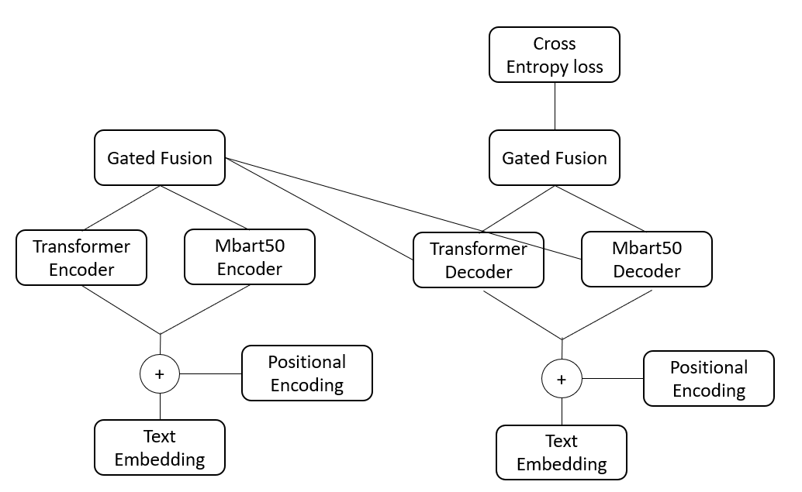
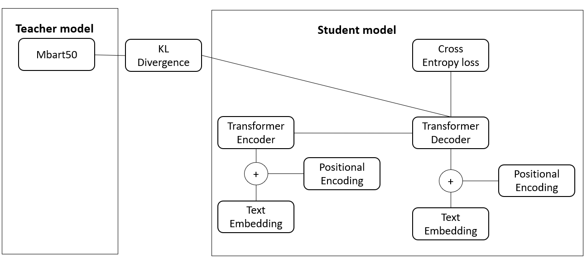

# 🎧📖 Multimodal-to-Translation

## 🧠 Overview
This project combines speech and text inputs to build a unified machine translation system. It includes preprocessing pipelines, training routines, and multiple model architectures for end-to-end speech recognition and translation.

## 🚀 Features

### 🔊 Audio Preprocessing
- Resampling
- Audio augmentation:
  - **Time shift**: Randomly shifts the waveform left or right
  - **Add noise**: Adds random background noise
- Spectrogram generation:
  - Short-Time Fourier Transform (STFT)
  - Power spectrum extraction (|STFT|²)
- Spectrogram augmentation:
  - **Time masking**: Randomly masks segments along the time axis
  - **Frequency masking**: Randomly masks bands along the frequency axis
- Log-Mel Spectrogram:
  - Mel filter bank transformation
  - Log scaling and normalization

### 📝 Text Preprocessing
- Removal of digits and punctuation

### 🧠 Models
- **DeepSpeech**:  
  Uses ResNet-34 for audio feature extraction. Outputs are passed through a Transformer-based encoder-decoder.  
  - Encoder trained with **CTC loss**
  - Decoder trained with **Cross-Entropy loss**
  - Losses: **(1 − α) x Cross-Entropy + α x  CTC loss**

- **DeepTranslationWithDistillation**:  
  Fine-tunes mBART50 as a teacher model and distills it into a custom Transformer Seq2Seq model.  
  - Losses: **(1 − α) x Cross-Entropy + α x KL Divergence**

- **DeepTranslationWithGated**:  
  Gated fusion of mBART50 and Transformer encoders/decoders to combine pretrained language knowledge with task-specific modeling.

---

## 🗂️ Build Pipeline

### 1. 🔊 Audio Processing

#### a) Transcription

#### b) Original Waveform

#### c) Add Noise  
Scales and adds random noise to simulate real-world background interference.  

#### d) Shift  
Randomly shifts the waveform to simulate latency or alignment noise.  

#### e) Spectrogram  
Applies STFT and calculates the power spectrum.  

#### f) Time Mask  
Simulates missing segments in the time domain to improve generalization.  

#### g) Frequency Mask  
Simulates frequency dropouts (e.g., due to environmental interference).  

#### h) Log-Mel Spectrogram  
Transforms linear frequency scale to Mel scale, applies log compression, and normalizes.  

---

### 2. 🧠 Model Architectures

#### a) DeepSpeech

#### b) Machine Translation with Gated Fusion

#### c) Machine Translation with Distillation

